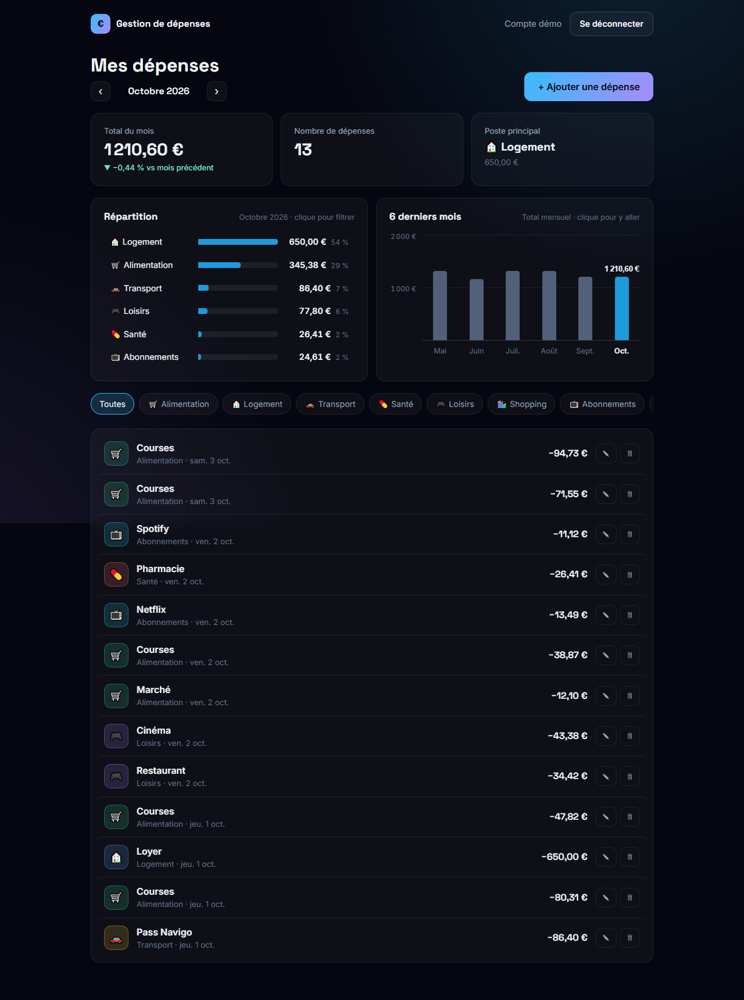
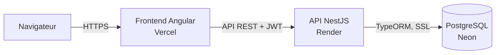
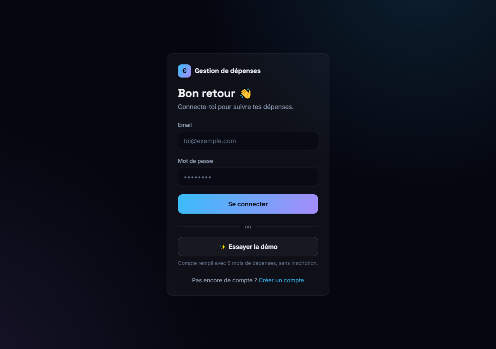
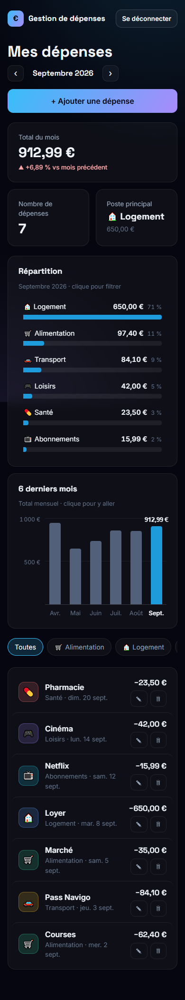

# Gestion de dépenses

Application web Full Stack pour suivre ses dépenses mois par mois et voir où part son argent.

**[▶ Essayer la démo](https://gestion-depense-rosy.vercel.app)** : bouton « Essayer la démo » sur la page de connexion, aucune inscription nécessaire.

> L'API est hébergée sur une offre gratuite qui se met en veille : la première connexion peut prendre jusqu'à une minute.



## Fonctionnalités

- Inscription et connexion (JWT), session conservée après rechargement
- Ajout, modification et suppression de dépenses (montant, catégorie, date, description)
- Navigation par mois et filtre par catégorie
- Résumé du mois : total, nombre de dépenses, poste principal, variation par rapport au mois précédent
- Graphiques : répartition par catégorie et évolution sur 6 mois (cliquables)
- Compte de démonstration réinitialisé à chaque connexion
- Interface responsive (mobile et ordinateur)

## Stack

| Partie | Technologies |
|---|---|
| Frontend | Angular 21 (composants standalone, signals, sans zone.js), formulaires réactifs, SCSS |
| Backend | NestJS 12, TypeORM, class-validator, JWT, bcrypt |
| Base de données | PostgreSQL (Neon) |
| Tests | Vitest (backend et frontend) |
| Hébergement | Vercel (frontend), Render (API), Neon (base) |

## Architecture



Le frontend appelle l'API avec un token JWT ajouté automatiquement par un intercepteur HTTP. L'API vérifie le token avec un guard, valide les données avec des DTO, puis interroge PostgreSQL.

## Choix techniques

- **Isolation des données** : l'identifiant de l'utilisateur vient toujours du token, jamais de la requête. Un utilisateur ne peut ni lire ni modifier les dépenses d'un autre (protection contre l'IDOR) : une dépense étrangère renvoie 404, sans révéler qu'elle existe.
- **Mots de passe** : hachés avec bcrypt, jamais renvoyés par l'API (`select: false`). Le message d'erreur de connexion est le même que l'email existe ou non.
- **Montants exacts** : stockés en `numeric(12,2)` plutôt qu'en nombre à virgule flottante. Les pourcentages sont calculés en centimes entiers, pour éviter les erreurs d'arrondi (50,375 % donnait 50,37 % au lieu de 50,38 %).
- **Statistiques en SQL** : totaux par catégorie et par mois calculés par PostgreSQL (`SUM`, `GROUP BY`). Seules quelques lignes transitent, pas toutes les dépenses.
- **Migrations versionnées** : le schéma évolue uniquement par des migrations TypeORM, appliquées au démarrage de l'API (`synchronize` désactivé).
- **Dates sans piège de fuseau horaire** : les dates des dépenses sont manipulées au format `AAAA-MM-JJ` en heure locale, sans `toISOString()`, qui peut décaler d'un jour.
- **Validation** : les DTO rejettent les champs inconnus (`forbidNonWhitelisted`), ce qui empêche par exemple d'envoyer un `userId` pour écrire au nom d'un autre.

## Lancer le projet en local

Prérequis : Node.js 22 ou plus, et une base PostgreSQL (une base gratuite [Neon](https://neon.tech) suffit).

```bash
git clone https://github.com/nyadjou-maximekevin/gestion-depense.git
cd gestion-depense
```

**API** (http://localhost:3000)

```bash
cd backend
npm install
cp .env.example .env   # puis renseigner DATABASE_URL et JWT_SECRET
npm run start:dev      # applique les migrations au démarrage
```

**Frontend** (http://localhost:4200), dans un second terminal

```bash
cd frontend
npm install
npm start
```

**Tests**

```bash
cd backend && npm test
cd frontend && npm test
```

## API

| Méthode | Route | Description |
|---|---|---|
| `POST` | `/auth/register` | Créer un compte |
| `POST` | `/auth/login` | Se connecter, renvoie un token |
| `POST` | `/auth/demo` | Se connecter au compte de démonstration |
| `GET` | `/auth/me` | Utilisateur connecté 🔒 |
| `GET` | `/depenses?du=&au=&categorie=` | Lister ses dépenses 🔒 |
| `POST` | `/depenses` | Ajouter une dépense 🔒 |
| `PATCH` | `/depenses/:id` | Modifier une dépense 🔒 |
| `DELETE` | `/depenses/:id` | Supprimer une dépense 🔒 |
| `GET` | `/depenses/statistiques?mois=AAAA-MM` | Statistiques du mois et des 6 derniers mois 🔒 |
| `GET` | `/health` | État de l'API et de la base |

🔒 : en-tête `Authorization: Bearer <token>` requis.

## Structure

```
backend/src/
├── auth/        inscription, connexion, guard JWT
├── users/       entité et service utilisateur
├── depenses/    CRUD, filtres, statistiques
├── demo/        compte de démonstration
└── database/    configuration TypeORM et migrations
frontend/src/app/
├── core/        services, intercepteur, guards, modèles
├── components/  formulaire de dépense, graphiques
└── pages/       connexion, inscription, tableau de bord
```

## Aperçus

| Connexion | Mobile |
|---|---|
|  |  |

## Auteur

**Maxime Nyadjou**, développeur Full Stack Angular / NestJS
[GitHub](https://github.com/nyadjou-maximekevin) · [LinkedIn](https://www.linkedin.com/in/maxime-nyadjou-a55765396)
